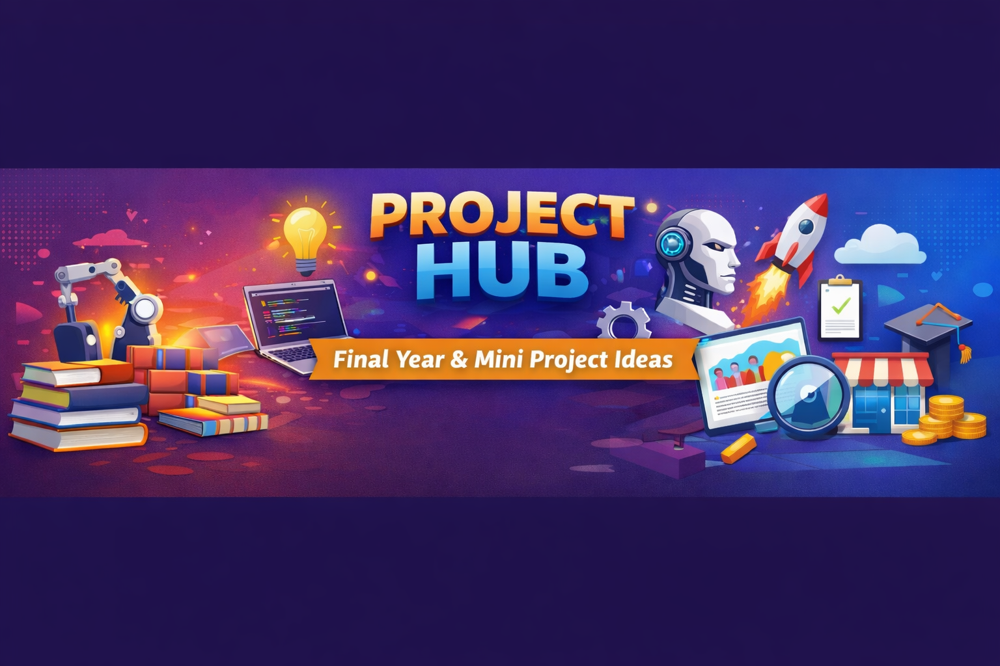

# 🌟 PROJECT HUB – Ideas, Paths & Resources

A practical, no-nonsense collection of project ideas students can actually build and showcase.

---

## 🤔 Confused About What Project to Build?

Motivation isn’t the problem.  
**Direction is.**

Most students either:
- Build tiny projects that don’t matter  
- Copy YouTube clones without understanding  
- Start big projects and never finish  

**Project Hub exists to fix that.**

This repository focuses on:
- ✅ Real problems students face daily  
- ✅ Projects you can finish (not abandon)  
- ✅ Skills that translate to internships & jobs  
- ✅ Clean ideas you can explain in interviews  

No toy apps. No enterprise nonsense.

---

## 🧩 What Each Project Includes

Every idea is designed with:
1. **Clear problem statement**
2. **Core features (minimum scope)**
3. **Optional improvements**
4. **Suggested tech stack**
5. **Direct learning resources (no searching)**

---

## 🚀 Project Difficulty Levels

| Level | Who Should Build | Focus |
|------:|----------------|-------|
| 🟢 Level 1 | Beginners | Logic, confidence, basics |
| 🟡 Level 2 | Intermediate | APIs, state, structure |
| 🔴 Level 3 | Advanced | Backend, systems, scale |

---

## 🟢 Level 1 – Beginner Friendly Projects

| Project Name | What You’ll Build | Direct Tutorial |
|-------------|------------------|----------------|
| Study Planner | Daily & weekly study planner | https://youtu.be/ZJgZpYk6Fjo |
| Expense Tracker | Track daily expenses | https://youtu.be/XuFDcZABiDQ |
| Password Generator | Secure password generator | https://youtu.be/iKo9pDKKHnc |
| Notes Organizer | Save & search notes | https://youtu.be/8GPPJpiLqHk |
| Attendance Calculator | Attendance % + alerts | https://youtu.be/Hg80AjDNnJk |
| Resume Builder | Simple resume creator | https://youtu.be/3Kq1MIfTWCE |
| Quiz App | MCQ-based quiz app | https://youtu.be/riDzcEQbX6k |
| CGPA Calculator | Semester CGPA calculator | https://youtu.be/W0wWwglE1Vc |

---

## 🟡 Level 2 – Intermediate Projects

| Project Name | What You’ll Build | Direct Tutorial |
|-------------|------------------|----------------|
| Weather Dashboard | Weather app using API | https://youtu.be/WZNG8UomjSI |
| Internship Tracker | Track applied internships | https://youtu.be/6BozpmSjk-Y |
| Skill Gap Analyzer | Skills vs job role analyzer | https://youtu.be/4Z6F6kZJt3M |
| Movie Explorer | Movie search app (API) | https://youtu.be/1yG8YyKpZ8Y |
| Blog Platform | Markdown-based blog | https://youtu.be/rgUp302f_lY |
| Certificate Vault | Store academic certificates | https://youtu.be/0o0kNeOyH98 |
| Habit Tracker | Track habits & streaks | https://youtu.be/RTdH7F0bR8E |

---

## 🔴 Level 3 – Advanced Projects

| Project Name | What You’ll Build | Direct Tutorial |
|-------------|------------------|----------------|
| Placement Prep System | Tests, analytics & progress | https://youtu.be/7CqJlxBYj-M |
| Learning Management System | Courses & tracking | https://youtu.be/9R2hV6qO6aA |
| Job Portal | Job posting & applications | https://youtu.be/8dWL3wF_OMw |
| Project Collaboration Tool | Team tasks & boards | https://youtu.be/7Z9Jr1j1K3g |
| E-Commerce Platform | Products & orders | https://youtu.be/UKdQjQX1Pko |

---

## 🧠 How to Write These in Your Resume (Important)

Use this structure:

**Problem → Solution → Tech → Outcome**

Example:
> Built a Certificate Vault to help students securely manage academic documents using HTML, CSS, JavaScript, improving accessibility and organization.

No exaggeration. No buzzwords.

---

## 🤝 Contribution Guide

You can contribute by:
- Adding a **new project idea**
- Improving descriptions
- Adding **better tutorials**
- Submitting your finished project

First-time contributors are welcome.

---

## 🌱 Roadmap

- [ ] Add backend-only projects  
- [ ] Add AI + ML beginner projects  
- [ ] Provide sample resumes  
- [ ] Convert into a website  

---

## ⭐ Support

If this repository helped you:
- ⭐ Star it
- 📢 Share with juniors
- 🛠️ Build something real

Learning grows faster together.
